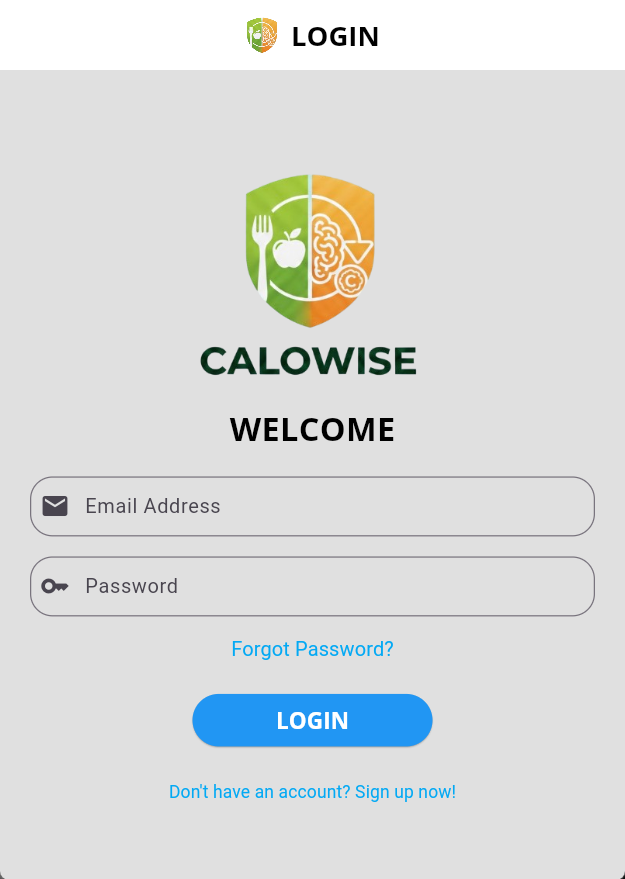
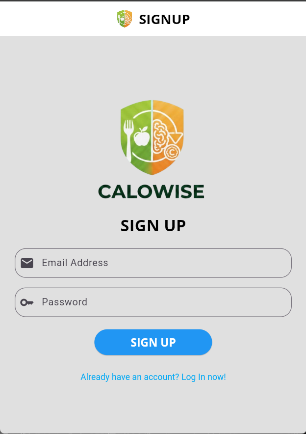
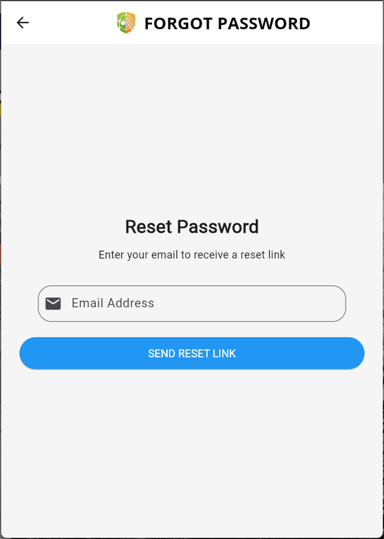
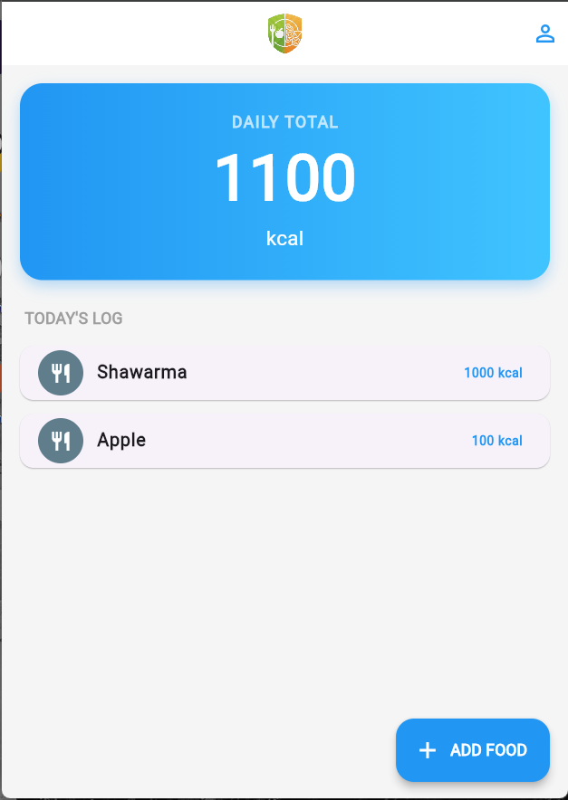
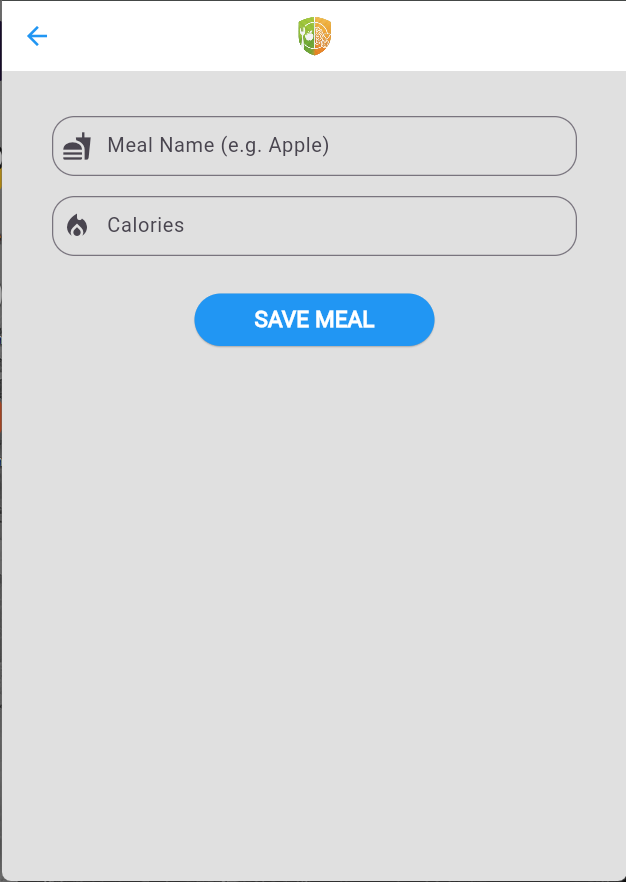
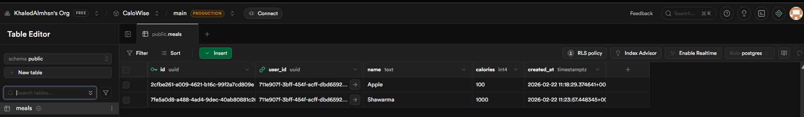

# CaloWise

A calorie tracking application built with Flutter and Supabase.

## Project Description
CaloWise is a fitness-focused mobile application designed for efficient daily calorie management. It provides a secure authentication system and a real-time database to track nutritional intake.

### Core Features
* **Authentication**: Secure Sign Up, Login, and Logout via Supabase Auth.
* **Password Recovery**: Integrated "Forgot Password" flow with email-based reset links and in-app password updates.
* **Calorie Tracking**: 
    * Add meals with specific calorie values.
    * View a daily summary card aggregating total caloric intake.
    * List view of all meals logged for the current session.
* **Data Management**: Persistent storage via Supabase PostgreSQL.
* **User Interface**: Swipe-to-delete functionality for meal logs and a profile management screen.

## Technical Stack
* **Frontend**: Flutter (Dart)
* **Backend/Database**: Supabase
* **State Management**: StatefulWidget / FutureBuilder

## Database Schema
The application requires a `meals` table in Supabase with the following structure:
| Column | Type | Description |
| --- | --- | --- |
| id | uuid | Primary Key (Default: gen_random_uuid()) |
| user_id | uuid | Foreign Key (References auth.users.id) |
| name | text | Name of the food item |
| calories | int4 | Calorie count |
| created_at | timestamptz | Timestamp (Default: now()) |

## App Screens

### Authentication

  
  
  

### Daily Log & Management

  
  
  

### Backend Integration

  

## Installation
1.  Clone the repository.
2.  Run `flutter pub get`.
3.  Configure Supabase credentials in `main.dart`.
4.  Execute `flutter run`.
